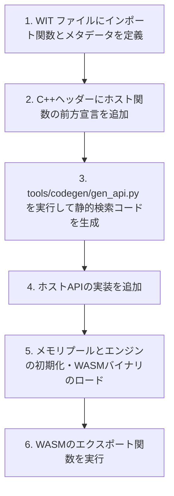

# 導入ガイド：WASMエンジン使用の流れ (docs/getting_started.md)

このドキュメントでは、本プロジェクトのマイコン向け極小WASM実行ライブラリをプロジェクトに導入し、WASMバイナリをロード・実行するまでの全体的な開発手順について解説します。

---

## 1. 全体フロー

WASMを実行するまでの基本的な手順は以下の通りです。



---

## 2. 各ステップの詳細

### ステップ 1: API設定ファイル (WIT) の記述
WASMモジュール内で呼び出すホストAPIを設定します。
* **WIT ファイル**（例: `hostapi.wit`）に、`import` 関数と、それに対応するC++関数名（`/// @cpp-func:`）およびインクルードヘッダー（`/// @cpp-header:`）を記述します。
* 指定したヘッダー（例: `host_apis.hpp`）に、ホスト関数のC++プロトタイプ宣言を記述します。

### ステップ 2: 静的検索コードの生成
WITファイルを元に、二分探索用のC++ソースコードを自動生成します。
以下のコマンドを実行します。

```bash
python3 tools/codegen/gen_api.py hostapi.wit src/wasm_api_static.cpp include/wasm_api_static.hpp
```
これにより、指定したヘッダー（例: `host_apis.hpp`）を `#include` した、静的ルックアップ処理用の `src/wasm_api_static.cpp` が生成されます。

### ステップ 3: プラットフォーム（OS）の選択
プロジェクトの対象ターゲット（OS/ベアメタル）に応じたプラットフォームファイルをビルド対象に選択します。
`CMakeLists.txt` の以下のフラグを環境に合わせて設定します。

* **Windows**: 自動的に `windows/wasm_platform.cpp` を選択
* **macOS**: 自動的に `macos/wasm_platform.cpp` を選択
* **FreeRTOS**: CMakeオプション `USE_FREERTOS=ON` を指定し `freertos/wasm_platform.cpp` を選択
* **μITRON**: CMakeオプション `USE_UITRON=ON` を指定し `uitron/wasm_platform.cpp` を選択

### ステップ 4: ホストAPIの実装
C++側で、WASMから呼び出されるホストAPIを実装します。
（例: `demo/hello/main.cpp` 内での実装など）

```cpp
embwasm::WasmResult MyHostFunc(
    embwasm::WasmEngine& engine,
    const embwasm::WasmValue* args, 
    uint32_t arg_count, 
    embwasm::WasmValue* results, 
    uint32_t result_count) noexcept 
{
    // 実装...
    return embwasm::WasmResult::kOk;
}
```

### ステップ 5: メモリプールとエンジンの初期化
動的ヒープを使用しないため、専用のメモリプールインスタンスを作成してエンジンに渡します。
メモリプールの容量は `include/wasm_config.hpp` の `kMemoryPoolSize` で定義されます。

```cpp
#include "wasm_config.hpp"
#include "wasm_memory_pool.hpp"
#include "wasm_api.hpp"
#include "wasm_engine.hpp"

// 1. 専用メモリプールの作成
embwasm::WasmMemoryPool pool;

// 2. WASMエンジンの初期化
embwasm::WasmEngine engine;
engine.Init(pool); // 内部で標準ホストモジュールも初期化されます
```

### ステップ 6: WASMバイナリのロードと実行
バイト配列としてのWASMバイナリをロードし、エクスポート関数を呼び出します。

```cpp
// WASMバイナリデータのロード
embwasm::WasmResult load_res = engine.Load(kWasmBinary, sizeof(kWasmBinary));
if (load_res != embwasm::WasmResult::kOk) {
    // ロードエラー処理
}

// 引数の設定 (例: 引数なし)
embwasm::WasmValue result; // 結果格納用バッファ

// "run" 関数の実行 (引数0個、戻り値1個)
embwasm::WasmResult exec_res = engine.Execute("run", nullptr, 0, &result, 1);
if (exec_res == embwasm::WasmResult::kOk) {
    // 実行成功。result に結果が格納されています。
}
```

---

## 3. ビルドと実行

プロジェクト全体は CMake で構成されています。ビルドとデモプログラムの実行は以下で行います。

```bash
# ビルド
cmake -B build -S .
cmake --build build

# デモの実行
./build/demo/hello/embwasm_demo_hello
```
